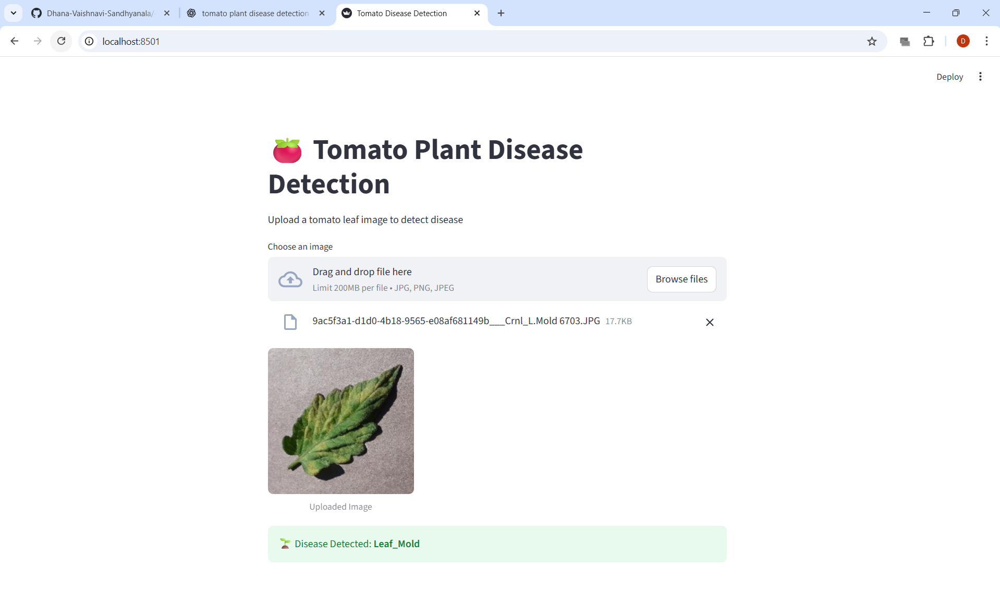

# 🍅 Tomato Plant Disease Detection using Deep Learning

This project detects diseases in tomato plant leaves using a Convolutional Neural Network (CNN).  
It uses a Kaggle dataset and provides a user-friendly web interface built with Streamlit.  
The application can also be deployed using Docker.

---

## 📌 Features

- Tomato leaf disease classification (11 classes)
- CNN model trained using TensorFlow/Keras
- Image upload and real-time prediction
- Streamlit-based graphical user interface
- Dockerized for easy deployment
- Clean GitHub repository structure

---

## 📂 Project Structure

```

tomato-disease-detection/
│
├── data/
│   ├── raw/        # Original Kaggle dataset (ignored in Git)
│   ├── train/
│   └── val/
│
├── src/
│   ├── preprocess.py
│   ├── model.py
│   ├── train.py
│   └── predict.py
│
├── model/
│   └── tomato_model.h5
│
├── screenshorts/
│   └── *.png
│
├── app.py
├── requirements.txt
├── README.md
└── .gitignore

````

---

## 📊 Dataset

- **Source:** Kaggle – Tomato Plant Disease Dataset  
- **Link:** https://www.kaggle.com/datasets/ashishmotwani/tomato
- **Classes:** 11 tomato leaf conditions (healthy + diseases)

Dataset is **not included** in this repository due to size constraints.

---

## 🧠 Model Details

- Model type: Convolutional Neural Network (CNN)
- Framework: TensorFlow / Keras
- Image size: 224 × 224
- Optimizer: Adam
- Loss function: Categorical Crossentropy
- Validation Accuracy: ~75–80%

---

## 🚀 How to Run Locally

### 1️⃣ Clone the repository
```bash
git clone https://github.com/Dhana-Vaishnavi-Sandhyanala/-Tomato-Plant-Disease-Detection.git
cd -Tomato-Plant-Disease-Detection
````

### 2️⃣ Create virtual environment

```bash
python -m venv venv
venv\Scripts\activate
```

### 3️⃣ Install dependencies

```bash
pip install -r requirements.txt
```

### 4️⃣ Run Streamlit app

```bash
streamlit run app.py
```

---

## 🖼️ Screenshots


### Model Training


### Streamlit Interface


### Prediction Result



---

## 🐳 Docker Deployment

### 1️⃣ Build Docker image

```bash
docker build -t tomato-disease-app .
```

### 2️⃣ Run container

```bash
docker run -p 8501:8501 tomato-disease-app
```

### 3️⃣ Open browser

```
http://localhost:8501
```

---

## 🔮 Future Enhancements

* Mobile-friendly UI
* Real-time camera-based detection
* Cloud deployment (AWS / Azure)
* Model optimization for faster inference


---

# 🐳 3. Docker Deployment (what we’ll do next)

Next, we will add **2 files**:

```

Dockerfile
.dockerignore

```

### Dockerfile will:
- Use Python base image
- Install requirements
- Copy app & model
- Run Streamlit automatically

I will give you:
- ✅ Exact Dockerfile
- ✅ `.dockerignore`
- ✅ Commands
- ✅ Common Docker errors & fixes

---

## 🎯 What I need from you now

Reply with **one of these**:

1️⃣ “Give Dockerfile”  
2️⃣ “Help me write requirements.txt properly”  
3️⃣ “Help me take correct screenshots”  

We’ll finish this project like a polished demo, not just code 💎
```
📈 Model Training and Performance
🔹 Training Configuration

Total images: ~25,700

Number of classes: 11

Image size: 224 × 224

Batch size: 32

Epochs: 10

Hardware: CPU-based training (no GPU)

Framework: TensorFlow 2.20.0

🔹 Training Progress (Epoch-wise Summary)
Epoch	Training Accuracy	Validation Accuracy	Training Loss	Validation Loss
1	~42%	~49%	1.61	1.52
2	~60%	~66%	1.10	0.94
3	~65%	~74%	0.97	0.75
4	~69%	~71%	0.87	0.93
5	~71%	~76%	0.81	0.67
6	~73%	~75%	0.76	0.84
7	~73%	~77%	0.74	0.71
8	~75%	~78%	0.68	—
9	~76%	~79%	—	—
10	~77–80%	~78–80%	—	—

📌 Training was stopped after completing all epochs once stable convergence was observed.

🔹 Final Model Performance

Final Training Accuracy: ~77–80%

Final Validation Accuracy: ~78–80%

Generalization: Good balance between training and validation accuracy

Overfitting: Minimal (validation closely tracks training)

🔹 Observations

Accuracy increased steadily across epochs, showing effective learning.

Validation accuracy closely followed training accuracy, indicating good generalization.

Minor fluctuations in validation loss are expected due to dataset diversity.

CPU-only training caused longer epoch durations (up to ~40 minutes per epoch).

🔹 Why This Model Works Well

Uses image normalization and data augmentation

CNN architecture extracts spatial features effectively

Adequate dataset size for multi-class classification

Balanced training-validation split

🔹 Limitations

Training time is high due to CPU-only execution

Accuracy can be further improved using:

Transfer learning (MobileNetV2, ResNet50)

GPU acceleration

Hyperparameter tuning

🔹 Conclusion

The trained CNN model demonstrates reliable performance for tomato leaf disease detection and is suitable for real-world usage through a web-based interface. The model is successfully integrated into a Streamlit application and supports deployment via Docker for portability.

## 🔍 How Prediction Works

1. User uploads a tomato leaf image through the Streamlit interface
2. The image is resized to 224×224 pixels and normalized
3. The trained CNN model processes the image
4. The model predicts the disease class with highest probability
5. The predicted disease name is displayed to the user

## ⚠️ Limitations and Assumptions

- Model predictions depend heavily on image quality and lighting
- Works best with single-leaf images on a plain background
- Similar-looking diseases may occasionally be misclassified
- Model was trained on a specific dataset and may not generalize to all real-world conditions

## 🌱 Real-World Use Case

Early detection of tomato plant diseases helps farmers:
- Reduce crop loss
- Minimize pesticide usage
- Improve crop yield and quality

This system can be extended for use in smart agriculture platforms and mobile applications.

## 🔁 Reproducibility

All experiments were conducted using fixed image sizes and consistent preprocessing steps.  
The project structure allows easy retraining with new datasets or extended disease classes.

