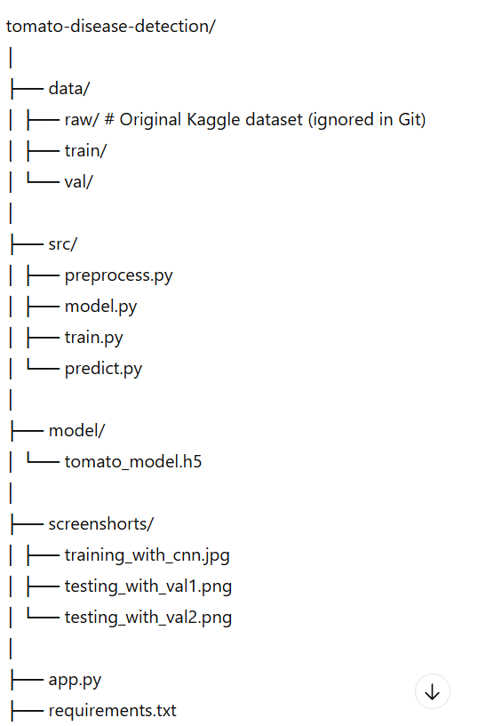
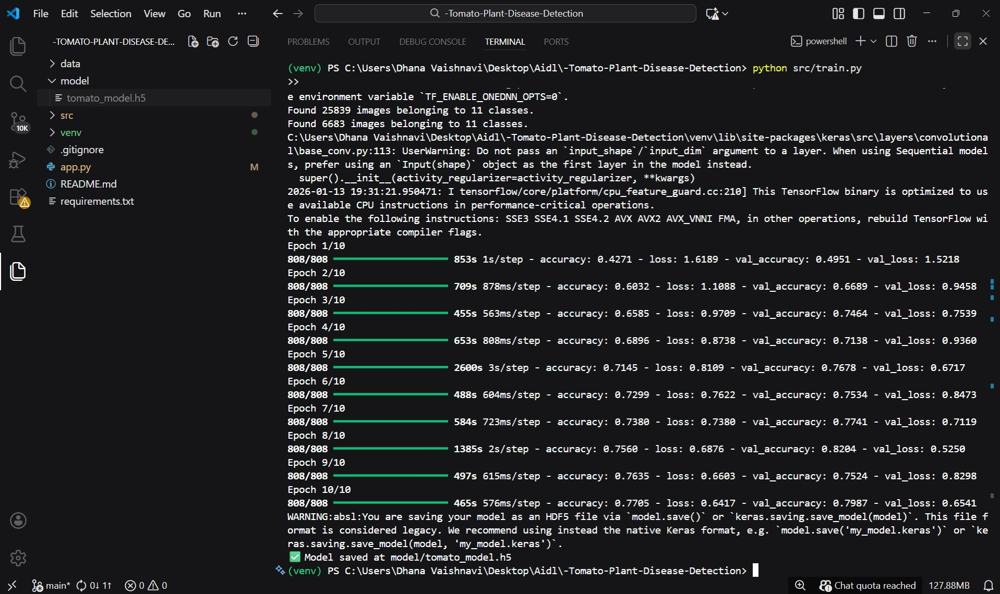
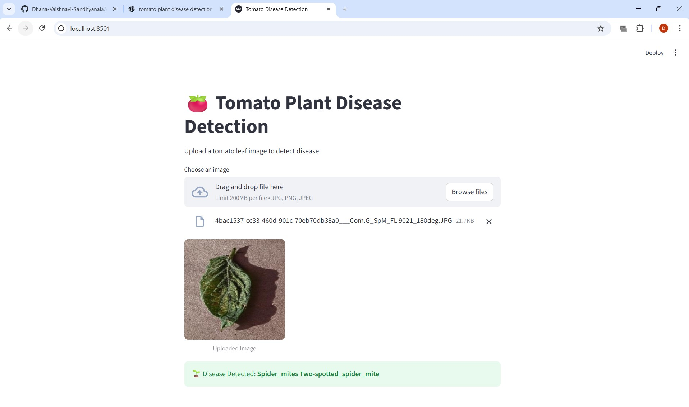

# 🍅 Tomato Plant Disease Detection using Deep Learning

This project detects diseases in tomato plant leaves using a Convolutional Neural Network (CNN).  
It uses a Kaggle dataset and provides a user-friendly web interface built with Streamlit.  
The application can also be deployed using Docker.

---

## 📌 Features

- Tomato leaf disease classification (11 classes)
- CNN model trained using TensorFlow/Keras
- Image upload and real-time prediction
- Streamlit-based graphical user interface
- Dockerized for easy deployment
- Clean GitHub repository structure

---

## 📂 Project Structure


---

## 📊 Dataset

- **Source:** Kaggle – Tomato Plant Disease Dataset  
- **Link:** [Kaggle Dataset](https://www.kaggle.com/datasets/ashishmotwani/tomato)  
- **Classes:** 11 tomato leaf conditions (healthy + diseases)  

> Dataset is **not included** in this repository due to size constraints.

---

## 🧠 Model Details

- **Model type:** Convolutional Neural Network (CNN)  
- **Framework:** TensorFlow / Keras  
- **Image size:** 224 × 224  
- **Optimizer:** Adam  
- **Loss function:** Categorical Crossentropy  
- **Training Epochs:** 10  
- **Batch size:** 32  
- **Validation Accuracy:** ~78–80%  

### 📈 Epoch-wise Training Summary

| Epoch | Training Accuracy | Validation Accuracy | Training Loss | Validation Loss |
|-------|-----------------|------------------|---------------|----------------|
| 1     | 42%             | 49%              | 1.61          | 1.52           |
| 2     | 60%             | 66%              | 1.10          | 0.94           |
| 3     | 65%             | 74%              | 0.97          | 0.75           |
| 4     | 69%             | 71%              | 0.87          | 0.93           |
| 5     | 71%             | 76%              | 0.81          | 0.67           |
| 6     | 73%             | 75%              | 0.76          | 0.84           |
| 7     | 73%             | 77%              | 0.74          | 0.71           |
| 8     | 75%             | 78%              | 0.68          | —              |
| 9     | 76%             | 79%              | —             | —              |
| 10    | 77–80%          | 78–80%           | —             | —              |

**Observations:**
- Steady increase in accuracy shows effective learning.
- Validation accuracy closely tracks training accuracy → good generalization.
- Minor fluctuations in validation loss are expected due to dataset diversity.
- CPU-only training caused longer epoch durations (~40 min per epoch).

**Limitations:**
- Training time is high due to CPU-only execution.
- Accuracy can be improved using transfer learning (MobileNetV2, ResNet50) and GPU acceleration.

---

## 🖼️ Screenshots

### Model Training
![Training Logs]

### Streamlit Interface
![Home]

### Prediction Result


---

## 🚀 How to Run Locally

### 1️⃣ Clone the repository
```bash
git clone https://github.com/Dhana-Vaishnavi-Sandhyanala/-Tomato-Plant-Disease-Detection.git
cd -Tomato-Plant-Disease-Detection
2️⃣ Create virtual environment
python -m venv venv
venv\Scripts\activate

3️⃣ Install dependencies
pip install -r requirements.txt

4️⃣ Run Streamlit app
streamlit run app.py

🐳 Docker Deployment
1️⃣ Build Docker image
docker build -t tomato-disease-app .

2️⃣ Run container
docker run -p 8501:8501 tomato-disease-app

3️⃣ Open browser
http://localhost:8501


